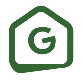

<p align="center">
  <a href="https://gidda.vercel.app" target="blank">
    
  </a>
</p>

# 🚀 Giddaa - Real Estate Portal

[](https://www.typescriptlang.org/docs/handbook/2/everyday-types.html)
[](https://react.dev/learn/start-a-new-react-project)
[](https://nextjs.org/docs/getting-started/installation)


## Setup

```sh
$ (ssh) git clone https://github.com/Raashot12/gidda.git
$ cd gidda
$ npm cache clean --force
$ npm install
# Or, npm install --legacy-peer-deps
# TODO copy .env credentials
$ npm run dev
```

#### Usage

> Local: http://localhost:3000

> Login: http://localhost:3000/log-in   
> Dashboard: http://localhost:3000/dashboard
> Dev: https://gidda.vercel.app
> Login: https://gidda.vercel.app/log-in   
> Dashboard: https://gidda.vercel.app/dashboard

## Jest Unit Testing

```sh
$ npm run test
```

## OpenAPI Code Generation

```sh
$ npm run api-generate
```

## Documentation

|   # | Service | URL                                                                                                                                           |
| --: | :------ | :-------------------------------------------------------------------------------------------------------------------------------------------- |
|   1 | Gidda   | https://gidda.vercel.app                                                                                                                      |
|   2 | Figma   | https://www.figma.com/design/TR4GXLbkhPOdN1LiXZsdZO/Frontend-Interview-Test?node-id=1-19576&t=ZSGyIAoosuHEcKBz-0                              |
|   3 | Notion  | https://giddaa.notion.site/GIDDAA-FRONTEND-TECHNICAL-INTERVIEW-INSTRUCTIONS-6a4b828d491044d38fac4452d1d03b7a#18b33b9acc77809086afd07d4e313104 |

## Screenshots


